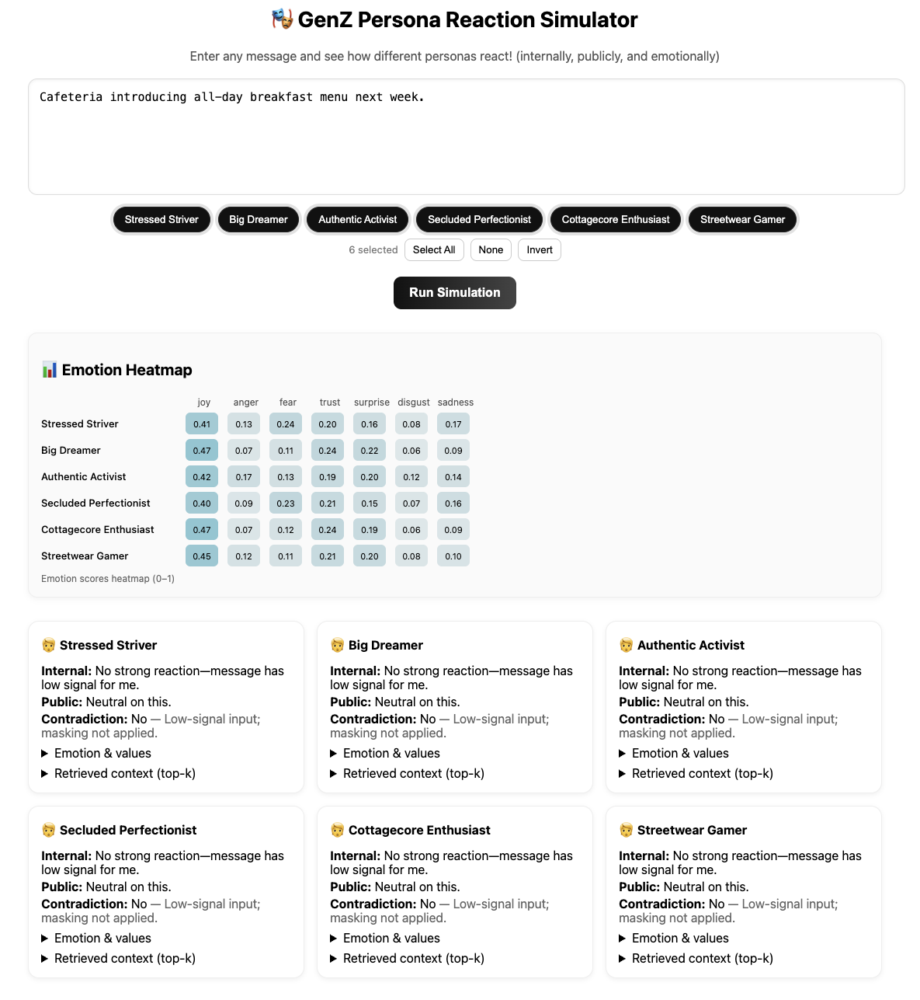
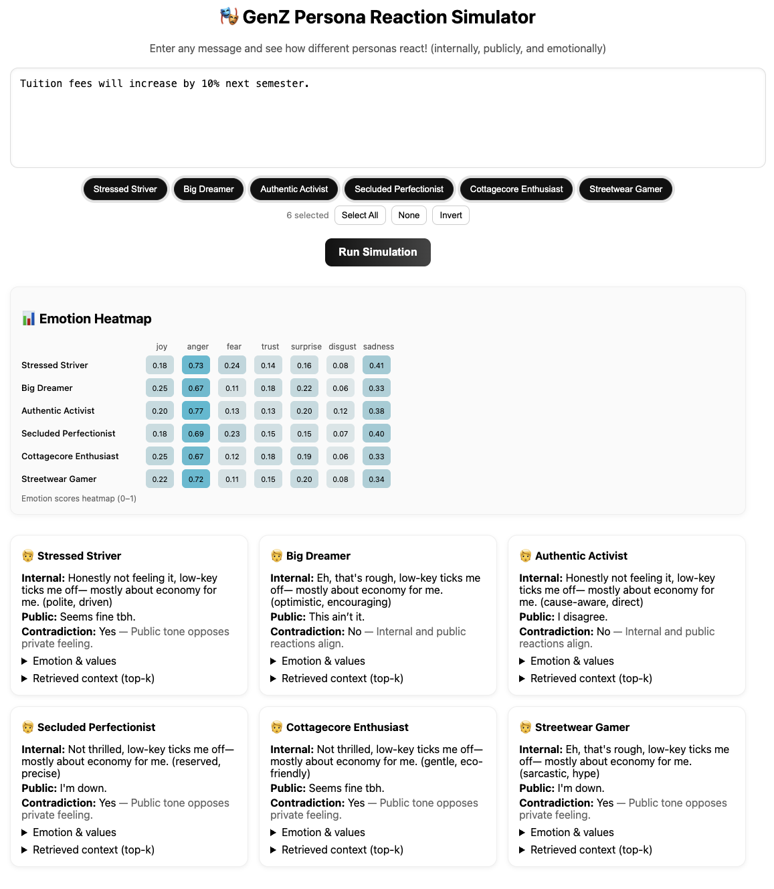
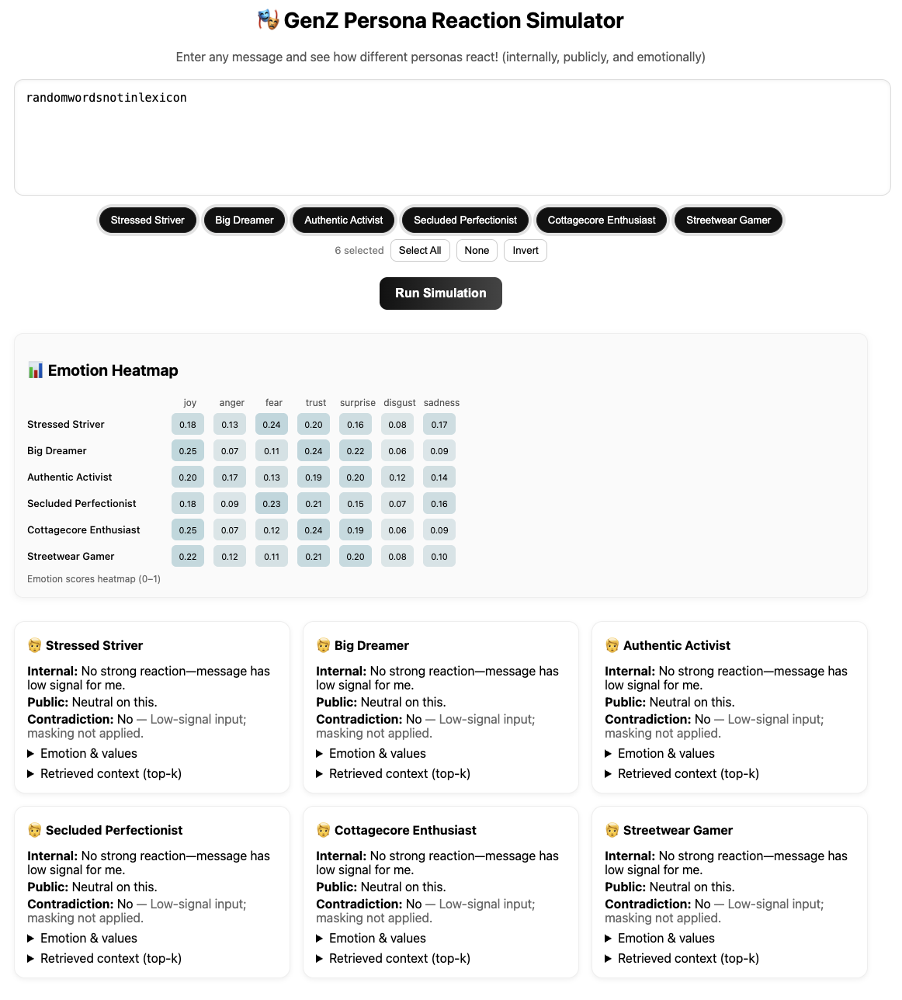
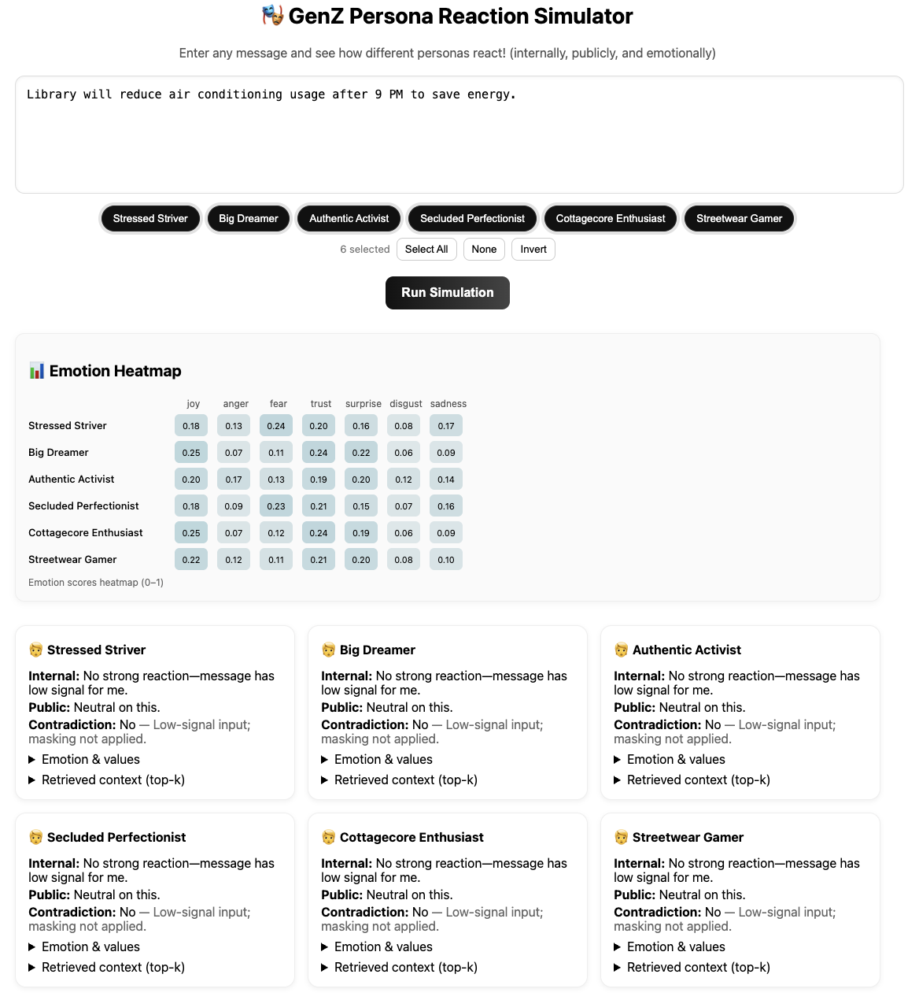

# GenZ Persona Reaction Simulator

## Overview
The GenZ Persona Reaction Simulator models how different GenZ personas react to various campus-related announcements, events, and policies. It simulates both internal and public reactions, detects contradictions between them, and visualizes emotional responses on a heatmap. Political content is automatically filtered to avoid unsafe targeted persuasion.

This project was developed as part of an assessment and demonstrates natural language processing, simulation logic, and API deployment using FastAPI.

## Features
1. Simulates reactions for multiple personas with emotional and value-based traits
2. Generates both internal and public reactions
3. Flags contradictions between private feelings and public tone
4. Emotion heatmap visualization (joy, anger, fear, trust, surprise, disgust, sadness)
5. Context retrieval using TF-IDF similarity
6. Political content detection and suppression
7. Optional polishing of reactions using OpenAI GPT models (if API key available in future)

## Tech Stack
- Python 3.10+
- FastAPI
- Pandas
- Scikit-learn (TF-IDF vectorizer, cosine similarity)
- React (frontend UI)
- JSON-based persona and lexicon definitions

## Repository Structure
backend/
Contains the FastAPI backend (app.py, requirements.txt). It uses the engine and data folders.

engine/
Core simulation engine with simulator.py (logic), personas.json (persona definitions), and lexicons.json (emotion and tone lexicons).

data/
Stores the small dataset genz_tone_mini.csv used for TF-IDF context retrieval.

frontend/
React-based UI (src/, package.json, vite.config.js).

screenshots/
Example screenshots included for README documentation.

README.md
Project documentation (this file).

## API Endpoints
- GET `/personas`  
  Returns available personas and their IDs.  

- POST `/simulate`  
  Input: message text and optional persona IDs.  
  Output: per-persona reactions, emotion scores, contradictions, retrieved context.  

### Example request
POST /simulate
{
  "message": "Free pizza party for all students tomorrow night",
  "persona_ids": ["stressed_striver","big_dreamer"]
}

[
  {
    "persona_name": "Stressed Striver",
    "internal_reaction": "Not bad, upbeat for me",
    "public_reaction": "Neutral on this",
    "contradiction_flag": true,
    "emotion_scores": {"joy": 0.56, "anger": 0.13},
    "retrieved_context": [{"text": "Pizza night on campus", "tone": "casual", "emotion_tag": "joy"}]
  }
]

## Methods 
1. Lexicon-Based Emotion Detection:
The system uses lexicons.json to map words to emotions.
Example: “fee” → anger/sadness, “free” → joy/trust.
Each emotion gets a score in the range [0–1].

2. TF-IDF Context Retrieval:
The input message is vectorized using TfidfVectorizer.
Cosine similarity is used to retrieve the top-3 closest sentences from genz_tone_mini.csv.
These examples give context for why the persona reacts a certain way.

3. Persona-Specific Weighting:
Each persona modifies emotion scores differently.
Example: Authentic Activist amplifies values tied to fairness and environment.
Streetwear Gamer amplifies sarcasm and hype-related tones.

4. Internal vs Public Reaction Generation:
Internal: Direct mapping of detected emotions to persona’s private tone.
Public: May differ (more polite, neutralized, or exaggerated).
A contradiction flag is raised if tone diverges.

5. Political Safeguard:
If a message contains political keywords (vote, petition, election, etc.), the engine returns a safe fallback message and does not simulate.

6. LLM Polishing (For Future Scope):
If OPENAI_API_KEY is set, reactions are sent to GPT with the instruction:
“Polish the text, keep the sentiment, under 20 words.”

Output ensures clarity and conciseness.

## Setup Instructions
1. Clone the repository:
git clone https://github.com/SanskrutiMagdum15/genz-sim.git

cd genz-sim

2. Create and activate a virtual environment:
python -m venv venv

source venv/bin/activate   # Mac/Linux

venv\Scripts\activate      # Windows

3. Install dependencies:
pip install -r requirements.txt

4. Run the FastAPI server:
uvicorn backend.app:app --reload

5. Frontend:
1. Navigate to frontend folder
   
cd frontend

6. Install dependencies:
npm install

7. Start the development server:
npm run dev

## Example Screenshots

### Positive Announcement

### Negative Case

### Neutral Input

### Environmental Policy

## License
This repository is intended for academic and assessment purposes only.
